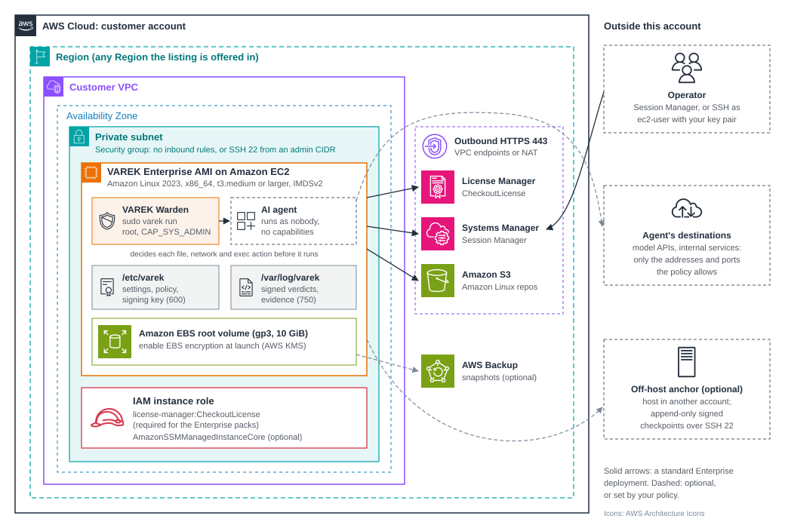

# VAREK Enterprise on AWS: Deployment Guide

Version 1.0, for VAREK Enterprise 1.23.0 on AWS Marketplace.
Published by Sober Agentic Infrastructure, Inc. (SAI).

This guide covers deploying, operating, backing up, upgrading and getting
support for the VAREK Enterprise AMI sold on
[AWS Marketplace](https://aws.amazon.com/marketplace/pp/prodview-6fdmjpuimvx64).
Every command says where it runs: **on the instance** (a shell on the VAREK
EC2 instance) or **in your AWS account** (AWS CloudShell, or any shell with
the AWS CLI and credentials for the account that runs VAREK).

Contents

1. [Overview](#1-overview)
2. [Prerequisites](#2-prerequisites)
3. [Architecture](#3-architecture)
4. [Security](#4-security)
5. [Costs](#5-costs)
6. [Sizing](#6-sizing)
7. [Deploy](#7-deploy)
8. [Test and troubleshoot](#8-test-and-troubleshoot)
9. [Health checks](#9-health-checks)
10. [Backup and recovery](#10-backup-and-recovery)
11. [Routine maintenance](#11-routine-maintenance)
12. [Emergency maintenance](#12-emergency-maintenance)
13. [Support](#13-support)
14. [FTR requirement index](#14-ftr-requirement-index)

---

## 1. Overview

### What VAREK does

VAREK is a pre-execution authorization runtime for AI agents. The VAREK
Warden starts your agent and decides every file open, network connection and
program launch the agent attempts against your policy, at the Linux kernel
boundary (seccomp user notification), before the action happens. Only
actions the policy decides as SATISFIED run. UNSATISFIED and UNKNOWN actions
are refused, the agent gets a permission error, and the decision is written
to a hash-chained, Ed25519-signed verdict stream that can be audited and
exported as CycloneDX 1.6 authorization evidence.

### Use cases

- **Running AI agents on regulated data.** Limit a clinical or financial
  agent to the directories, hosts and programs your policy names, with the
  HIPAA or SOC 2 policy packs as a starting point.
- **Evidence for auditors.** Every decision is recorded with the policy line
  that made it; `varek export` produces signed evidence an auditor can verify
  with the public key alone.
- **Containing agent mistakes and prompt injection.** An agent talked into
  reading credentials or calling an unapproved host is refused before the
  read or connection happens, not detected afterwards.
- **Evaluating agent behaviour.** Run an agent under a strict policy and
  read `varek refusals` to see everything it tried that the policy does not
  allow.

### What a typical deployment contains

| Resource | Created by | Purpose |
|---|---|---|
| One Amazon EC2 instance from the VAREK Enterprise AMI | You, at launch | Runs the Warden and your agents |
| Its Amazon EBS root volume (gp3, 10 GiB by default) | EC2, at launch | Operating system, VAREK, settings and verdict streams |
| An IAM role and instance profile | You ([section 7.1](#71-create-the-instance-role)) | Lets the instance check your subscription with AWS License Manager |
| A security group | You, at launch | No inbound rules with Session Manager, or SSH 22 from an admin CIDR |
| Network path for outbound HTTPS | Your VPC (existing NAT gateway, or VPC interface endpoints) | License check, Session Manager, OS patches |
| Off-host anchor host (optional) | You ([section 7.6](#76-optional-add-an-off-host-anchor)) | Keeps signed checkpoints where the instance's root cannot rewrite them |

VAREK creates no other AWS resources. It does not create S3 buckets, KMS
keys, databases, load balancers or public endpoints.

### Deployment options

- **Single instance, single Availability Zone.** The standard deployment:
  one instance supervises the agents that run on it. Each `varek run` starts
  its own Warden for one agent; several agents can run at once on one
  instance.
- **Several instances across Availability Zones.** VAREK keeps no shared
  state between instances, so for availability you run independent
  instances in more than one Availability Zone, each with its own settings
  and signing key, and place agents on them as your workload requires. Keep
  the policy the same on each with your configuration management, or by
  copying `/etc/varek/policy.txt`.
- **Several Regions.** The same as several Availability Zones: launch the
  AMI in each Region you need. The license check runs in each instance's own
  Region, against your account's entitlement.

There is no VAREK cluster, controller or database to make highly available.
A failed instance is replaced from the AMI and its backed-up settings
([section 10](#10-backup-and-recovery)).

### Time to deploy

About 15 minutes: 5 to launch the instance and attach the role, 5 to set up
VAREK and run the preflight check, and a few more to run your first agent.
Adapting the policy pack to your own paths and hosts takes longer and
depends on your agent.

### Supported Regions

The AMI can be launched in every AWS Region in which AWS Marketplace offers
the listing. The current list is on the listing's **Pricing** tab, under the
Region selector.

---

## 2. Prerequisites

### Technical prerequisites

| Item | Requirement |
|---|---|
| Operating system | Amazon Linux 2023, included in the AMI |
| Architecture | x86_64 (64-bit Intel or AMD). Arm (Graviton) is not supported |
| Kernel | 5.14 or later, with seccomp user notification. The AMI's kernel meets this; `varek doctor` checks it |
| Instance type | t3.medium or larger x86_64 type ([section 6](#6-sizing)) |
| Storage | The 10 GiB gp3 root volume is enough for VAREK; add space for your agents and for verdict streams you keep on the instance |
| IAM | An instance role allowing `license-manager:CheckoutLicense` to use the Enterprise packs |
| Network | Outbound HTTPS 443 to AWS License Manager in the instance's Region (through a NAT gateway or a VPC interface endpoint) |
| Instance metadata | IMDSv2. The AMI requires it by default; the license check uses it to find the Region |
| Subscription | A VAREK Enterprise contract on AWS Marketplace (Tier A or Tier B). Without one, VAREK runs with the open-source VAREK Core packs |

There is no database, message queue or external service to install.

### Skills

The person deploying VAREK should be comfortable with:

- launching EC2 instances, attaching IAM roles and editing security groups;
- working in a Linux shell with `sudo`;
- reading a text policy file and the file paths, hosts and programs your
  agent uses, so the policy can be adapted to it.

No programming is required to deploy VAREK. Adapting a policy needs
knowledge of what your agent is supposed to touch.

### Environment configuration

- The instance runs in a VPC subnet with outbound HTTPS, as above.
- The instance profile from [section 7.1](#71-create-the-instance-role) is
  attached.
- Your agent's own dependencies (Python packages, model API keys, data
  directories) are installed on the instance. The agent is started by VAREK
  as the unprivileged user `nobody` by default, so files it needs must be
  readable by that user, or choose another user with `--run-as`.

---

## 3. Architecture



*Typical deployment: one VAREK instance in a private subnet of your VPC.*

- **The instance.** The VAREK Warden runs as root and starts your agent in
  its own PID namespace as an unprivileged user with every Linux capability
  dropped. Every file, network and program action the agent attempts is
  decided by the Warden before it happens.
- **Network.** The instance needs no inbound access when you administer it
  with AWS Systems Manager Session Manager. Outbound, it needs HTTPS to AWS
  License Manager (and to Systems Manager and the Amazon Linux repositories
  if you use them), through a NAT gateway or VPC interface endpoints. The
  instance belongs in a private subnet; it needs no public IP address.
- **The agent's own traffic.** Your agent's connections (model APIs,
  internal services) leave through the same VPC routing, but only to the
  addresses and ports your policy allows. Every other connection is refused
  by the Warden before it is made.
- **Third-party and hybrid components.** VAREK itself calls no third-party
  service. The destinations your agent uses are third-party or on-premises
  integration points that you choose and list in the policy. The optional
  off-host anchor can live in another AWS account, on premises, or in any
  sink that the instance's root cannot rewrite.
- **AWS services used.** Amazon EC2, Amazon EBS, AWS IAM, AWS License
  Manager; optionally AWS Systems Manager, AWS Backup, AWS KMS (EBS
  encryption) and VPC interface endpoints.

---

## 4. Security

### Root privileges (why `sudo` is required)

`sudo varek init`, `sudo varek run`, `sudo varek preflight --run` and
`sudo varek bench` need root. The reasons:

- The Warden needs `CAP_SYS_ADMIN` to start the agent as init of its own
  PID namespace, so that the agent and every process it spawns are killed if
  the Warden exits or crashes. Without that, a crashed supervisor could leave
  unsupervised agent processes running.
- The Warden reads the signing key (`/etc/varek/log.key`, mode 600, root
  only) to sign the verdict stream, and the agent must not be able to read
  it.

The agent itself never runs as root. The Warden drops to the user in
`run_as` (default `nobody`), removes every capability from the bounding,
ambient, permitted, effective and inheritable sets, and verifies the drop
before starting the agent. `varek refusals`, `varek status`, `varek runs`,
`varek policy list/show/check` and `varek license` run without root.

Setting `VAREK_WARDEN_NO_PIDNS=1` lets the Warden start without
`CAP_SYS_ADMIN`, but then processes the agent spawns are not guaranteed to
stop if the Warden crashes. SAI does not recommend it for production.

> **Warning:** do not run agents with `--run-as root`. The Warden prints a
> warning if you do: the agent then holds every capability and only the
> seccomp filter holds it back.

### Least privilege

- **IAM.** The instance role needs exactly one action,
  `license-manager:CheckoutLicense`. Add `AmazonSSMManagedInstanceCore` only
  if you use Session Manager. Do not attach broader policies to the VAREK
  instance: anything the instance role allows, an agent that escaped its
  policy could attempt through the instance's credentials. The policy packs
  allow only the hosts they list, and none lists the instance metadata
  address (169.254.169.254), so the agent cannot fetch the role's
  credentials; keep it out of your policy.
- **Operating system.** Administer the instance as `ec2-user` through
  `sudo`. Password and root SSH logins are disabled in the AMI; no account
  has a password.
- **Agent user.** Run each agent as an unprivileged user that owns only the
  files the agent needs. The default is `nobody`; choose a dedicated user per
  agent with `sudo varek init --run-as <user>` or `sudo varek run --run-as
  <user>`. The Warden refuses an unprivileged user in group 0.
- **Policy.** Start from the closest pack and remove what your agent does not
  need. Allow paths read-only where the agent only reads. `varek policy check`
  reports rules that never fire.
- **Network.** No inbound rules with Session Manager; otherwise SSH 22 from
  your admin network only.

### Public resources

VAREK creates no public resources. The AMI opens no network port other than
SSH (22), which the security group you choose controls. Launch the instance
without a public IP address in a private subnet unless you have a reason to
do otherwise.

### IAM roles and policies

| Role | Where | Policy | Why |
|---|---|---|---|
| Instance role (e.g. `VarekEnterpriseInstance`) | Your account, attached to the instance | [`instance-license-policy.json`](../varek/v1_4/packaging/aws-marketplace/iam/instance-license-policy.json): `license-manager:CheckoutLicense` on `*` | Checks that your account holds a VAREK Enterprise entitlement before an Enterprise pack is selected. Trust policy: [`ec2-trust.json`](../varek/v1_4/packaging/aws-marketplace/iam/ec2-trust.json) |
| Same role, optional | Your account | AWS managed `AmazonSSMManagedInstanceCore` | Session Manager access without inbound SSH |

`CheckoutLicense` is called with a provisional checkout for the product and
contract dimension only. No information about your workload is sent. VAREK
makes no other AWS API call.

### Keys

| Key | Location | Created by | Purpose |
|---|---|---|---|
| Verdict-stream signing key | `/etc/varek/log.key` (Ed25519 private key, mode 600, root) | `sudo varek init` on your instance | Signs each run's start, its checkpoints and its end |
| Its public key | `/etc/varek/log.key.pub` | Same | Verifies verdict streams and exported evidence; can be shared with auditors |
| Anchor SSH key (optional) | `/etc/varek/anchor_ssh_key` | You ([section 7.6](#76-optional-add-an-off-host-anchor)) | Lets the forwarder append to the off-host anchor; that account can only append |
| EC2 key pair (optional) | Your account | You, at launch | SSH login as `ec2-user`, if you do not use Session Manager |
| EBS encryption key (optional) | AWS KMS | AWS (`aws/ebs`) or you (customer managed key) | Encrypts the root volume at rest |

The AMI ships with no keys of any kind. Each instance makes its own signing
key at `varek init`; no two customers or instances share one, and SAI never
has a copy.

### Secrets

VAREK stores no passwords, database credentials or API keys. Its only secret
is the signing key above:

- It stays in `/etc/varek`, readable by root only. `varek doctor` fails if it
  is readable by group or others.
- The Warden refuses to start if the policy would let the agent open the key,
  the anchor, the verdict stream or a raw disk.
- Back it up separately from the verdict streams
  ([section 10](#10-backup-and-recovery)), and rotate it as in
  [section 11.1](#111-rotate-the-signing-key).

Secrets your agent uses (for example a model API key) belong to your agent.
Keep them where your agent reads them, readable only by the agent's user, and
allow that path in the policy read-only.

### Where sensitive data is stored

| Data | Location | Access |
|---|---|---|
| Verdict streams: every action the agent attempted, with file paths, network addresses and the deciding policy line | `/var/log/varek/verdicts-*.log` | Directory mode 750, root |
| Exported evidence (CycloneDX 1.6) | `/var/log/varek/*.cdx.json` (or where you write it) | Same |
| Settings and policy | `/etc/varek/varek.conf`, `/etc/varek/policy.txt`, `/etc/varek/packs/` | Readable; written by root |
| Refusal-breaker state (plan verification only) | `/var/lib/varek/` | Private to the Warden's user |

Verdict streams contain the paths and addresses your agent used. A path can
identify a person (for example a record directory named for a patient).
VAREK sends none of this data off the instance. The only outbound calls
VAREK makes are the license check (product and dimension) and, if you set it
up, anchor records (a run ID, an event name and a chain hash, never the
verdicts themselves).

### Encryption

- **At rest.** AWS Marketplace requires the AMI's own snapshot to be
  unencrypted so it can be scanned and copied, so encryption is set when you
  launch: tick **Encrypt** for the root volume (or turn on EBS encryption by
  default in the Region) and choose `aws/ebs` or your own KMS key. This
  encrypts the settings, signing key and verdict streams at rest.
- **In transit.** The license check uses the AWS CLI over HTTPS (TLS).
  Session Manager uses TLS; SSH is encrypted. The anchor forwarder sends
  records over SSH.
- **Integrity.** Verdict streams are hash-chained (SHA-256) and signed
  (Ed25519). This protects their integrity and lets anyone holding the public
  key detect tampering; it is not encryption. Use EBS encryption for
  confidentiality.

### Network configuration

| Direction | Port | Destination | Needed for |
|---|---|---|---|
| Inbound | none | none | With Session Manager |
| Inbound | TCP 22 | Your admin CIDR | SSH, if you do not use Session Manager |
| Outbound | TCP 443 | `license-manager.<region>.amazonaws.com`, or a `com.amazonaws.<region>.license-manager` interface endpoint | The license check |
| Outbound | TCP 443 | Systems Manager endpoints (`ssm`, `ssmmessages`, `ec2messages`) | Session Manager (optional) |
| Outbound | TCP 443 | Amazon Linux 2023 repositories (served from Amazon S3; an S3 gateway endpoint works) | OS patches |
| Outbound | TCP 22 | Your anchor host | Off-host anchor (optional) |
| Outbound | as your policy allows | Your agent's destinations | Your agent |
| Link-local | 169.254.169.254 | Instance metadata (IMDSv2) | Region lookup for the license check |

The security group can allow all outbound traffic: the Warden decides each
connection the agent attempts against the policy, whatever the security
group allows. A tighter egress rule set is a second layer, not a substitute.

---

## 5. Costs

### Billable services

| Service | Mandatory? | What drives the cost |
|---|---|---|
| VAREK Enterprise subscription (AWS Marketplace) | Yes, for Enterprise | Contract, billed through AWS Marketplace |
| Amazon EC2 | Yes | Instance type and hours |
| Amazon EBS | Yes | Root volume size and type (10 GiB gp3 by default), plus snapshots |
| Data transfer | Yes, usually small | VAREK's own traffic is a few small API calls; your agent's traffic is yours |
| NAT gateway or VPC interface endpoints | One of them, if the subnet has no other route to AWS endpoints | Hourly charge and data processed |
| AWS Systems Manager Session Manager | Optional | No additional charge for Session Manager itself |
| AWS Backup / EBS snapshots | Optional, recommended | Snapshot storage |
| AWS KMS | Optional | Customer managed key, if you use one instead of `aws/ebs` |
| Second instance for the off-host anchor | Optional | A small instance (any size that runs SSH) |

Prices for AWS services vary by Region and change over time; see the
[AWS Pricing Calculator](https://calculator.aws/).

### Software licensing

VAREK Enterprise is sold as a 12-month contract on AWS Marketplace:

| Dimension | Price | Support level |
|---|---|---|
| Enterprise Tier A | $75,000 per 12 months | Standard ([section 13](#13-support)) |
| Enterprise Tier B | $150,000 per 12 months | Priority |

The contract covers your AWS account; there is no per-instance or per-agent
charge. Pilots and other terms are available as private offers through
AWS Marketplace; ask support@soberagents.ai. The VAREK Warden and the five
VAREK Core packs are open source (MIT) and work without a subscription; the
subscription adds the HIPAA and SOC 2 packs and support.

---

## 6. Sizing

Size the instance for your agents. The Warden adds little CPU or memory of its
own: one Warden process per running agent, with a policy table of about 1 MB.

| Use | Suggested starting point |
|---|---|
| Evaluation, one or two agents | t3.medium (2 vCPU, 4 GiB) |
| Production, several concurrent agents | A general-purpose x86_64 type with headroom for the agents' own CPU and memory (for example the m-family at `large` or above) |
| Agents that load large local models | Size for the model; VAREK's share is negligible |

Measured overhead (`varek bench`, VAREK 1.23.0 on a t3.medium, healthcare
pack, median): refused actions are decided in 18 to 23 microseconds; an
allowed file open adds about 72 microseconds. Measure on your own instance
type with `sudo varek bench` (on the instance).

Storage: plan for the verdict streams your agents produce. Each decision is
one JSON line; an agent that makes many file opens produces a larger stream.
Check growth with `du -sh /var/log/varek` (on the instance) after a typical
run, and enlarge the volume or move old streams to your archive
([section 10](#10-backup-and-recovery)).

---

## 7. Deploy

### 7.1 Create the instance role

In your AWS account (AWS CloudShell is easiest), once per account:

```bash
B=https://raw.githubusercontent.com/kwdoug63/varek/main/varek/v1_4/packaging/aws-marketplace/iam
curl -fsSLO $B/ec2-trust.json
curl -fsSLO $B/instance-license-policy.json

aws iam create-role --role-name VarekEnterpriseInstance \
  --assume-role-policy-document file://ec2-trust.json
aws iam put-role-policy --role-name VarekEnterpriseInstance \
  --policy-name VarekLicenseCheck --policy-document file://instance-license-policy.json
aws iam create-instance-profile --instance-profile-name VarekEnterpriseInstance
aws iam add-role-to-instance-profile --instance-profile-name VarekEnterpriseInstance \
  --role-name VarekEnterpriseInstance
```

Optional, for Session Manager:

```bash
aws iam attach-role-policy --role-name VarekEnterpriseInstance \
  --policy-arn arn:aws:iam::aws:policy/AmazonSSMManagedInstanceCore
```

### 7.2 Launch the instance

In the AWS Marketplace listing, choose **Continue to Subscribe**, then
**Continue to Configuration** and **Launch through EC2**. In the EC2 launch
wizard:

1. **Instance type:** t3.medium or larger x86_64 ([section 6](#6-sizing)).
2. **Key pair:** your own, or none if you will use Session Manager.
3. **Network:** your VPC and a private subnet; no public IP unless needed.
4. **Security group:** no inbound rules (Session Manager), or SSH 22 from
   your admin CIDR.
5. **Storage:** keep 10 GiB gp3 or more, and tick **Encrypted**.
6. **Advanced details > IAM instance profile:** `VarekEnterpriseInstance`.
   Leave **Metadata version** as V2 only.

### 7.3 Connect

- Session Manager: in the EC2 console, select the instance and choose
  **Connect > Session Manager**. Then run `sudo -iu ec2-user`.
- SSH: `ssh -i <your-key.pem> ec2-user@<instance address>` from your admin
  network. Password login is disabled.

### 7.4 Set up VAREK

On the instance:

```bash
sudo varek doctor                  # is the host ready? (fails until init: no settings yet)
varek license                      # is this account licensed for Enterprise?
varek policy list                  # the policy packs available
sudo varek init --pack hipaa       # or soc2, healthcare, finance, cybersecurity, ...
sudo varek doctor                  # should now end with "Ready"
sudo varek preflight --run         # a real trial run under the policy, then its audit
```

`varek init` writes `/etc/varek/varek.conf`, copies the pack to
`/etc/varek/policy.txt`, creates the signing key and `/var/log/varek`.

### 7.5 Adapt the policy and run your agent

The packs contain example paths and addresses. Before production, on the
instance:

1. Edit `/etc/varek/policy.txt` (as root) so it allows exactly the paths,
   hosts and programs your agent needs. Host rules match the numeric address
   and port the agent dials (`allow host a.b.c.d:port`); the comments in each
   pack explain the rule forms.
2. Check it: `varek policy check` (add `--explain` for detail).
3. Run your agent under the Warden:

   ```bash
   sudo varek run -- python3 /path/to/your_agent.py
   ```

4. Review: `varek refusals` shows each refused action and the policy line or
   reason that decided it. Adjust the policy and repeat until only the
   actions you intend to refuse are refused.

Choose an Enterprise pack once with `sudo varek policy use <pack>` and run
without `--policy`. `--policy <enterprise pack>` checks the license on every
run, so a scheduled job would stop if the instance lost its role.

To run an agent as a service, put the `varek run` command in a systemd unit
(on the instance), for example:

```ini
# /etc/systemd/system/my-agent.service
[Unit]
Description=My agent under the VAREK Warden
After=network-online.target

[Service]
ExecStart=/usr/bin/varek run --run-as myagent -- /usr/bin/python3 /opt/myagent/agent.py
Restart=on-failure

[Install]
WantedBy=multi-user.target
```

Then `sudo systemctl daemon-reload && sudo systemctl enable --now my-agent`.

### 7.6 Optional: add an off-host anchor

The verdict stream is signed, but the instance's root holds the signing key.
To protect history against that host's root, send the signed checkpoints to a
second host that the instance's root cannot administer (for example a small
instance in another AWS account).

1. On the VAREK instance:
   `sudo ssh-keygen -t ed25519 -N '' -f /etc/varek/anchor_ssh_key`
2. On the anchor host, as root: copy `/opt/varek/tools/varek_anchor_receiver.sh`
   from the VAREK instance and run
   `./varek_anchor_receiver.sh --name <varek-host> --pubkey '<contents of anchor_ssh_key.pub>'`.
   It creates an account that can only append to an append-only file, and
   prints the anchor host's key fingerprint.
3. On the VAREK instance: pin the anchor host's key
   (`ssh-keyscan -t ed25519 <anchor-host> | sudo tee /etc/varek/anchor_known_hosts`,
   and compare `ssh-keygen -lf /etc/varek/anchor_known_hosts` with the
   printed fingerprint). Copy
   `/opt/varek/tools/systemd/varek-anchor-forward.service` to
   `/etc/systemd/system/`, set `ANCHOR_HOST` and set the script path in
   `ExecStart` to `/opt/varek/tools/varek_anchor_forward.py`, then
   `sudo systemctl daemon-reload && sudo systemctl enable --now varek-anchor-forward`.
4. Point VAREK at the anchor:
   `sudo varek init --force --pack <your pack> --anchor /run/varek/anchor.fifo --spool /var/lib/varek/anchor-spool`
   (add `--run-as <user>` and `--log-dir <dir>` if you set them before)
   (this keeps the existing signing key; if you edited `policy.txt`, it is
   kept as a `.bak-` file, so pass `--pack /etc/varek/policy.txt.bak-...` or
   restore it afterwards).
5. `sudo varek preflight --run` checks the forwarder and the anchor.

The forwarder spools through outages of the anchor host and resends after
restarts, so an outage delays anchoring but loses nothing.

---

## 8. Test and troubleshoot

### Test the deployment

On the instance:

1. `sudo varek doctor` ends with "Ready".
2. `varek license` shows `licensed: enterprise_tier_a` or `enterprise_tier_b`.
3. `sudo varek preflight --run` passes: it runs a real trial agent under
   your policy and audits the result.
4. A refusal test: run an agent that tries something your policy does not
   allow and confirm it is refused. With the `healthcare` pack, for example:

   ```bash
   sudo varek run -- /usr/bin/python3 -c 'exec("try: open(\"/etc/hostname\")\nexcept OSError: print(\"refused as expected\")")'
   varek refusals        # shows the open of /etc/hostname as refused
   sudo varek audit      # checks certificates, the hash chain and signatures
   sudo varek export     # writes signed CycloneDX evidence
   varek export --verify /var/log/varek/<run>.cdx.json
   ```

5. `sudo varek bench` runs a workload natively and under the Warden, checks
   every verdict and reports the overhead; it exits 1 if any verdict is wrong.

Add `--show-commands` to any `varek` command to see the underlying commands
it runs.

### Troubleshooting

| Symptom | Likely cause | Fix (on the instance) |
|---|---|---|
| `... needs root` | Command run without `sudo` | Rerun with `sudo` |
| `no configuration at /etc/varek/varek.conf` | `varek init` not run yet | `sudo varek init --pack <name>` |
| `[warden] CAP_SYS_ADMIN is required` | Warden started without root | Use `sudo varek run` |
| `could not check the license: ...` | No instance role, the role lacks `CheckoutLicense`, no route to License Manager, or IMDS unreachable | Attach the role from [7.1](#71-create-the-instance-role); check outbound 443 and IMDSv2; run `varek license` again |
| `no VAREK Enterprise entitlement for this AWS account` | The account running the instance has no active contract | Check the subscription in AWS Marketplace (**Manage subscriptions**); VAREK Core packs keep working |
| `policy ... does not lint` | Syntax error or unknown rule | `varek policy check --explain` |
| The agent fails with "Permission denied" | The policy refused an action | `varek refusals` names the action and the deciding line; allow it in the policy if it is intended |
| `[varek] the Warden did not start the agent` | Startup check failed (policy, key permissions, anchor, a path the agent may not reach) | The lines printed after it give the reason; `sudo varek doctor` and `sudo varek preflight --run` |
| `signing key ... is readable by group or others` | Key permissions changed | `sudo chmod 600 /etc/varek/log.key` |
| Anchor errors at start | Forwarder not running | `sudo systemctl status varek-anchor-forward` and its journal |
| `the policy file this run used is no longer on this host` (audit, export) | The policy changed since the run and the old one was deleted | Restore it from backup; `varek audit` finds it among `/etc/varek/policy.txt.bak-*` and the packs |

---

## 9. Health checks

On the instance:

| Command | What it tells you |
|---|---|
| `sudo varek doctor` | Host readiness: architecture and kernel, runtime built, settings, policy lints, signing-key permissions, log directory, anchor, license. Exits 0 when ready, 1 if there is a problem |
| `varek status` | Active policy and rule count, signing, anchor, agent user, last run and its allowed/refused counts |
| `varek runs` | Recent runs; `DONE: no` marks a run that is still going or was cut short |
| `varek license` | Subscription status (exit 0 when licensed) |
| `sudo varek audit` | Verifies the last run: certificates, hash chain, signatures, anchor; its `integrity:` line says how far the stream is protected |
| `systemctl status varek-anchor-forward` | The anchor forwarder, if used |

To monitor continuously:

- Run `sudo varek doctor` from cron or a systemd timer and alert on a
  non-zero exit, for example by sending it to Amazon CloudWatch with the
  CloudWatch agent or a CloudWatch custom metric.
- Watch `varek runs` for runs without `run_end` and unexpected spikes in
  refusals.
- In your AWS account, add a CloudWatch alarm on the instance's
  `StatusCheckFailed` metric.

---

## 10. Backup and recovery

### What to back up

| Path | Contents | Why |
|---|---|---|
| `/etc/varek/varek.conf`, `policy.txt`, `policy.txt.bak-*`, `packs/` | Settings and every policy used | `varek audit` and `varek export` need the exact policy a run used |
| `/etc/varek/log.key` | Signing key | Continue signing with the same key after a rebuild |
| `/etc/varek/log.key.pub` (and archived old `.pub` files) | Public keys | Verify old streams and evidence |
| `/etc/varek/anchor_ssh_key`, `anchor_known_hosts` | Anchor access | If you use an anchor |
| `/var/log/varek/` | Verdict streams and evidence | Your audit record |
| `/var/lib/varek/` | Breaker state, anchor spool | Plan verification and unsent anchor records |
| The anchor host's `/srv/varek-anchor/<host>.anchor.log` | Off-host checkpoints | Back it up from the anchor host's side |

VAREK has no database; these files are the complete state.

### How

- **Whole volume:** schedule EBS snapshots of the root volume with AWS Backup
  or Amazon Data Lifecycle Manager (in your AWS account). This captures
  everything above.
- **Audit record:** copy `/var/log/varek/` to your archive regularly (for
  example an S3 bucket with Object Lock), on the instance:
  `sudo aws s3 sync /var/log/varek s3://<your-bucket>/varek/<host>/`
  (add `s3:PutObject` for that bucket to a role you use for archiving).
- **Signing key:** keep a copy of `/etc/varek/log.key` apart from the verdict
  streams (for example in AWS Secrets Manager or offline), so one copy is
  never enough to rewrite and re-sign history.

### Recover an instance

1. Launch a new instance from the VAREK Enterprise AMI as in
   [7.2](#72-launch-the-instance), with the same instance profile. Or restore
   the root volume from a snapshot, and stop here after step 4.
2. On the new instance, restore `/etc/varek` (keep `log.key` at mode 600,
   owner root) and, if you want them on the instance, `/var/log/varek`
   (mode 750).
3. Restore `/var/lib/varek` if you use plan verification or an anchor.
4. `sudo varek doctor`, `varek license`, then `sudo varek preflight --run`.
5. If you use an anchor, reinstall the forwarder service ([7.6](#76-optional-add-an-off-host-anchor)
   step 3); the anchor host's account and key need no change if you restored
   `anchor_ssh_key`.

---

## 11. Routine maintenance

### 11.1 Rotate the signing key

Rotate the key on your schedule (for example yearly) or at once if you think
it was exposed. On the instance:

```bash
d=$(date +%Y%m%d)
sudo cp -p /etc/varek/log.key.pub /etc/varek/log.key.pub.$d   # keep the old public key
sudo shred -u /etc/varek/log.key
sudo rm /etc/varek/log.key.pub
sudo /opt/varek/tools/varek_keygen /etc/varek/log.key        # new log.key (600) and log.key.pub
sudo varek doctor
```

Runs after this are signed with the new key. Verify older streams and
evidence with the archived public key:

```bash
varek export --verify <old>.cdx.json --pubkey /etc/varek/log.key.pub.<date>
python3 /opt/varek/tools/varek_audit.py --policy <that run's policy> \
  --checker /opt/varek/tools/vdp_cert_check \
  --pubkey /etc/varek/log.key.pub.<date> <old verdict stream>
```

Give auditors the new public key. Rotate the anchor SSH key the same way:
make a new key, register it on the anchor host with
`varek_anchor_receiver.sh`, then remove the old one there.

No credentials are stored by VAREK that need rotating otherwise. Rotate your
EC2 key pairs and agent secrets under your own policies.

### 11.2 Patches and upgrades

- **Operating system.** On the instance:
  `sudo dnf upgrade --releasever=latest`, then reboot if the kernel or core
  libraries changed. Run `sudo varek doctor` afterwards.
- **VAREK.** Each VAREK release is published as a new version of the AWS
  Marketplace listing, built on current Amazon Linux 2023 patches. SAI
  announces releases and security advisories to subscribers. To upgrade:
  1. Launch a new instance from the new version, as in [7.2](#72-launch-the-instance).
  2. Copy `/etc/varek` from the old instance (and `/var/lib/varek` if used).
  3. `sudo varek doctor`, `varek policy check`, `sudo varek preflight --run`.
  4. Move your agents to the new instance, then retire the old one after
     archiving its `/var/log/varek`.
- **Supported versions.** SAI supports the current minor release and the
  previous minor release for 12 months after its successor ships. See the
  [CHANGELOG](../CHANGELOG.md) and each release's notes for changes.

### 11.3 License management

- The entitlement belongs to the AWS account that holds the contract. Run
  VAREK Enterprise in that account (or in accounts your organization shares
  the license with through AWS License Manager).
- `varek license` shows the status; `varek doctor` includes it.
- Renew or change tier in AWS Marketplace (**Manage subscriptions**) before
  the contract ends. When it ends, Enterprise packs can no longer be
  selected; the Warden and the VAREK Core packs keep working.
- The license is checked when an Enterprise pack is chosen (`varek init`,
  `varek policy use`) and on every `varek run --policy <enterprise pack>`.

### 11.4 AWS service limits

VAREK uses few AWS resources. The limits that can matter:

- **EC2 On-Demand vCPU quota** for the instance family you choose, per Region.
- **AWS License Manager API rate.** Each `varek run --policy <enterprise pack>`
  makes a `CheckoutLicense` call. Choose the pack once with
  `varek policy use` so runs make no call.
- **VPC interface endpoints and NAT gateways** per VPC, if you add them.

Check and request increases in the **Service Quotas** console in your AWS
account.

---

## 12. Emergency maintenance

### Fault conditions

| Fault | What VAREK does | What to do (on the instance) |
|---|---|---|
| The Warden crashes or is killed | The agent and everything it spawned are killed with it (PID namespace); nothing keeps running unsupervised. The verdict stream ends without `run_end` | `varek runs` shows `DONE: no`; audit what was recorded with `sudo varek audit --allow-incomplete`; restart the agent with `sudo varek run` (a systemd unit with `Restart=on-failure` does this) |
| The Warden refuses to start | The agent never starts; the reason is in the verdict log and printed by `varek run` | Fix the reason shown; `sudo varek doctor`, `sudo varek preflight --run` |
| The license check fails | Enterprise packs cannot be selected; an active policy and the Warden keep working | Check the role, network and subscription (section 8) |
| Legitimate actions are refused | The agent gets permission errors | `varek refusals`; correct the policy; `varek policy check` |
| The anchor host is unreachable | The forwarder spools checkpoints and resends when it returns | Restore the anchor host; check `systemctl status varek-anchor-forward` |
| The disk fills | New verdict streams cannot be written, so new runs fail | Archive and remove old streams from `/var/log/varek`, or enlarge the EBS volume |
| The instance fails | Its agents stop | Recover as in [section 10](#10-backup-and-recovery) |
| A suspected compromise of the instance | | Isolate the instance (security group with no rules), snapshot the volume for investigation, rotate the signing key from a clean instance, and contact SAI (Severity 1) |

### Recover the software

If the VAREK files on an instance are damaged or changed:

1. `sudo varek doctor` reports what is missing.
2. The cleanest fix is a new instance from the AMI with your backed-up
   `/etc/varek` ([section 10](#10-backup-and-recovery)): the software in
   `/opt/varek` is never modified by normal operation, so it does not need
   backing up.
3. If only the policy is damaged, choose a pack again with
   `sudo varek policy use <pack>`, or restore `/etc/varek/policy.txt` from a
   `.bak-` file or backup.
4. If only the signing key is lost, make a new one as in
   [11.1](#111-rotate-the-signing-key); older streams still verify with the
   archived public key.

---

## 13. Support

### How to get support

- **Email:** support@soberagents.ai, with the severity in the subject line.
- **Hours:** 8:00 to 18:00 US Central time, Monday to Friday, excluding US
  federal holidays.
- **Security vulnerabilities:** GitHub private vulnerability reporting on
  this repository, or email as described in [SECURITY.md](../SECURITY.md).
  Reports are acknowledged within 48 hours.
- Send with each request: the output of `varek doctor` and `varek version`,
  the relevant `varek refusals` output or verdict stream, and the policy.
  Replace any paths or addresses that identify people, and do not send
  protected health information or other regulated data.

### Support tiers

| | Tier A (standard) | Tier B (priority) |
|---|---|---|
| Channels | Email | Email and scheduled video calls |
| Named contacts | 2 | 5 |
| Onboarding | Two remote sessions | Four remote sessions and a compliance-mapping workshop |
| Policy reviews | One per year | One per quarter, plus up to four more before production changes |
| Security advisories before public disclosure | Yes | Yes |

### Response targets (business hours)

| Severity | Definition | Tier A | Tier B |
|---|---|---|---|
| 1 - Critical | VAREK stops production agents across the deployment, or a suspected security vulnerability | 8 business hours | 4 business hours, video call on request |
| 2 - High | A major function fails with no reasonable workaround (for example audit or evidence export) | 2 business days | 1 business day |
| 3 - Normal | A minor defect, a question, or help with a policy | 3 business days | 2 business days |

A response means a person at SAI has acknowledged the issue and started work
on it. For Severity 1, SAI sends a status update at least once each business
day until the issue is resolved or a workaround is in place. Targets are not
guarantees of resolution time. If a target is missed, your named contact can
escalate to SAI's founder and CEO. Your contract, order form or private offer
governs where it differs from this summary.

### Documentation

- This guide, the [Warden README](../varek/v1_4/README.md) and the
  [threat model](security/threat-model.md).
- `varek --help` and `varek <command> --help` on the instance.
- [varek-lang.org](https://varek-lang.org).

---

## 14. FTR requirement index

Where this guide answers each AWS Foundational Technical Review requirement
for customer-deployed software.

| Requirement | Section |
|---|---|
| INT-001 use cases | [1](#use-cases) |
| INT-002 typical deployment and resources | [1](#what-a-typical-deployment-contains), [3](#3-architecture) |
| INT-003 deployment options (single-AZ, multi-AZ, multi-Region) | [1](#deployment-options) |
| INT-004 time to deploy | [1](#time-to-deploy) |
| INT-005 supported Regions | [1](#supported-regions) |
| PRQ-001 technical prerequisites | [2](#technical-prerequisites) |
| PRQ-002 skills | [2](#skills) |
| PRQ-003 environment configuration | [2](#environment-configuration) |
| ARCH-001, ARCH-004, ARCH-005, ARCH-006 architecture diagrams | [3](#3-architecture) |
| DSEC-002 root privileges | [4](#root-privileges-why-sudo-is-required) |
| DSEC-003 least privilege | [4](#least-privilege) |
| DSEC-004 public resources | [4](#public-resources) |
| DSEC-005 IAM roles and policies | [4](#iam-roles-and-policies) |
| DSEC-006 keys | [4](#keys) |
| DSEC-007 secrets | [4](#secrets) |
| DSEC-008 sensitive data | [4](#where-sensitive-data-is-stored) |
| DSEC-009 encryption | [4](#encryption) |
| DSEC-010 network configuration | [4](#network-configuration) |
| CST-001 billable services | [5](#billable-services) |
| CST-002 cost model and licensing | [5](#software-licensing) |
| SIZ-001 sizing | [6](#6-sizing) |
| DAS-001 deployment steps | [7](#7-deploy) |
| DAS-004 testing and troubleshooting | [8](#8-test-and-troubleshoot) |
| HLCH-001 health checks | [9](#9-health-checks) |
| BAR-001 backup and recovery | [10](#10-backup-and-recovery) |
| RM-001 key rotation | [11.1](#111-rotate-the-signing-key) |
| RM-002 patches and upgrades | [11.2](#112-patches-and-upgrades) |
| RM-003 license management | [11.3](#113-license-management) |
| RM-004 service limits | [11.4](#114-aws-service-limits) |
| EMER-001 fault conditions | [12](#fault-conditions) |
| EMER-002 software recovery | [12](#recover-the-software) |
| SUP-001 support access | [13](#how-to-get-support) |
| SUP-002 support tiers | [13](#support-tiers) |
| SUP-003 SLAs | [13](#response-targets-business-hours) |
